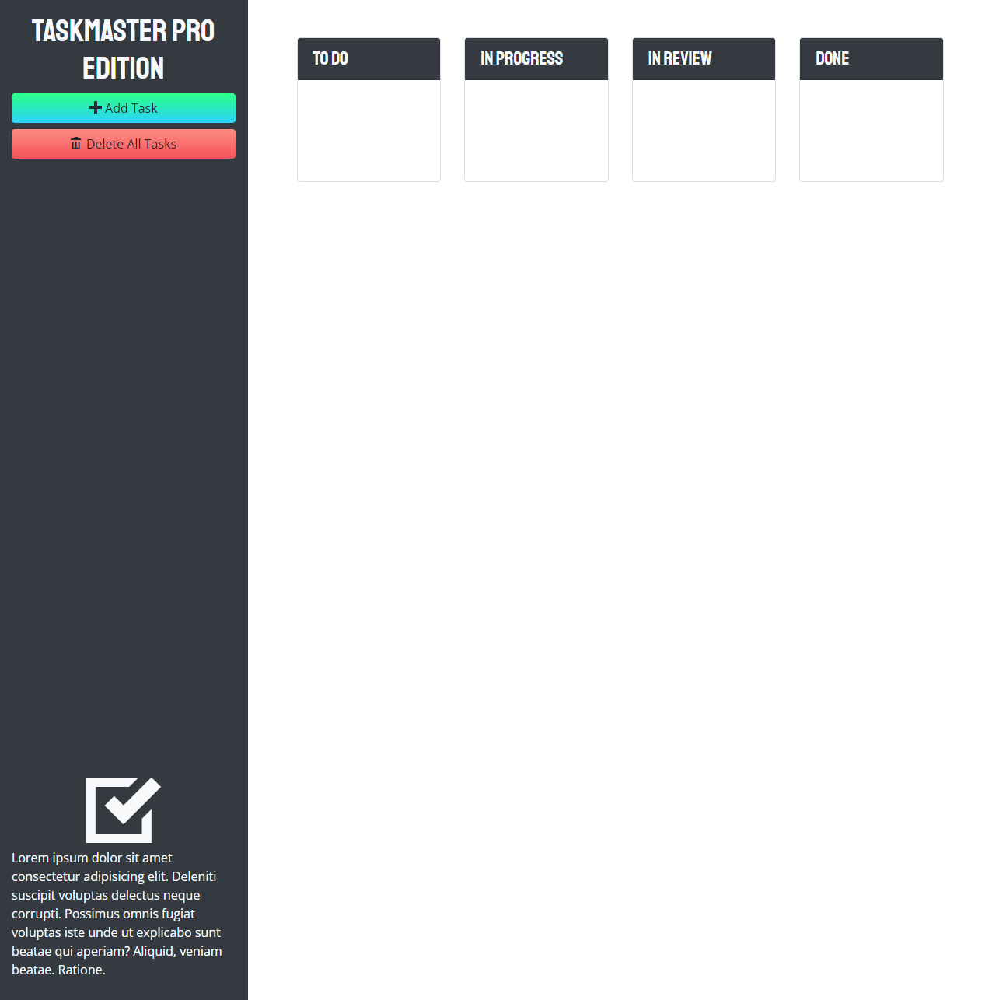

# Taskmaster Pro

## Description

An app for managing tasks in a Kanban way.

This was a project done for a coding bootcamp to practice the following skils:

- CSS
- Bootstrap
- JavaScript
- JavaScript Web APIs
- JQuery
- JQuery UI

## Features

- Create new tasks
- Add due dates to tasks
- Move tasks between boards by clicking and dragging
- Data persists after browser reload

## Screenshot

## Live Site
[Link](https://jdpasternak.github.io/taskmaster-pro)

